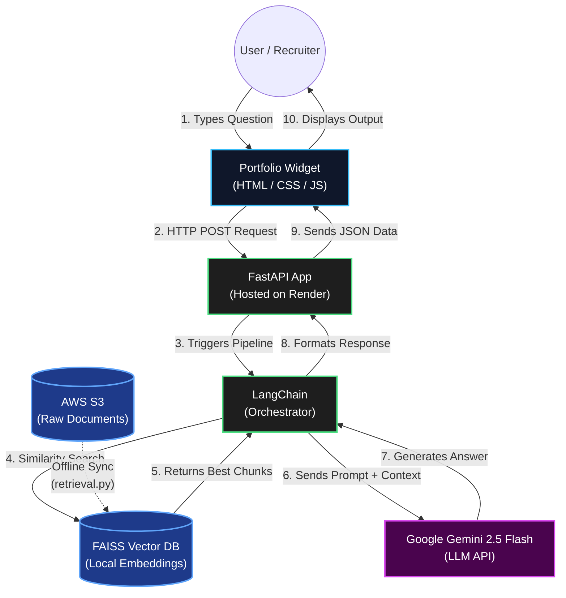

```mermaid
graph TD
    %% Define Node Colors
    classDef frontend fill:#0f172a,stroke:#38bdf8,stroke-width:2px,color:#fff
    classDef backend fill:#1e1e1e,stroke:#4ade80,stroke-width:2px,color:#fff
    classDef database fill:#1e3a8a,stroke:#60a5fa,stroke-width:2px,color:#fff
    classDef ai fill:#4a044e,stroke:#d946ef,stroke-width:2px,color:#fff

    %% Define the Nodes
    User((User / Recruiter))
    UI["Portfolio Widget\n(HTML / CSS / JS)"]:::frontend
    API["FastAPI App\n(Hosted on Render)"]:::backend
    LC["LangChain\n(Orchestrator)"]:::backend
    FAISS[("FAISS Vector DB\n(Local Embeddings)")]:::database
    S3[("AWS S3\n(Raw Documents)")]:::database
    Gemini["Google Gemini 2.5 Flash\n(LLM API)"]:::ai

    %% Define the Data Flow
    User -- "1. Types Question" --> UI
    UI -- "2. HTTP POST Request" --> API
    API -- "3. Triggers Pipeline" --> LC
    LC -- "4. Similarity Search" --> FAISS
    FAISS -- "5. Returns Best Chunks" --> LC
    LC -- "6. Sends Prompt + Context" --> Gemini
    Gemini -- "7. Generates Answer" --> LC
    LC -- "8. Formats Response" --> API
    API -- "9. Sends JSON Data" --> UI
    UI -- "10. Displays Output" --> User

    %% Offline Data Flow
    S3 -. "Offline Sync\n(retrieval.py)" .-> FAISS
```
