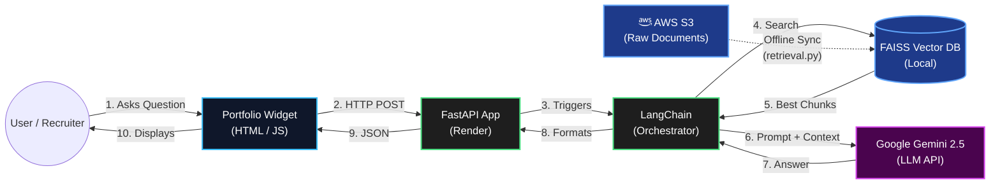

```mermaid
graph LR
    %% Define Node Colors
    classDef frontend fill:#0f172a,stroke:#38bdf8,stroke-width:2px,color:#fff
    classDef backend fill:#1e1e1e,stroke:#4ade80,stroke-width:2px,color:#fff
    classDef database fill:#1e3a8a,stroke:#60a5fa,stroke-width:2px,color:#fff
    classDef ai fill:#4a044e,stroke:#d946ef,stroke-width:2px,color:#fff

    %% Define the Nodes
    User((User / Recruiter))
    UI["Portfolio Widget\n(HTML / JS)"]:::frontend
    API["FastAPI App\n(Render)"]:::backend
    LC["LangChain\n(Orchestrator)"]:::backend
    FAISS[("FAISS Vector DB\n(Local)")]:::database
    S3["fab:fa-aws AWS S3\n(Raw Documents)"]:::database
    Gemini["Google Gemini 2.5\n(LLM API)"]:::ai

    %% Define the Data Flow
    User -- "1. Asks Question" --> UI
    UI -- "2. HTTP POST" --> API
    API -- "3. Triggers" --> LC
    LC -- "4. Search" --> FAISS
    FAISS -- "5. Best Chunks" --> LC
    LC -- "6. Prompt + Context" --> Gemini
    Gemini -- "7. Answer" --> LC
    LC -- "8. Formats" --> API
    API -- "9. JSON" --> UI
    UI -- "10. Displays" --> User

    %% Offline Data Flow
    S3 -. "Offline Sync\n(retrieval.py)" .-> FAISS
```
